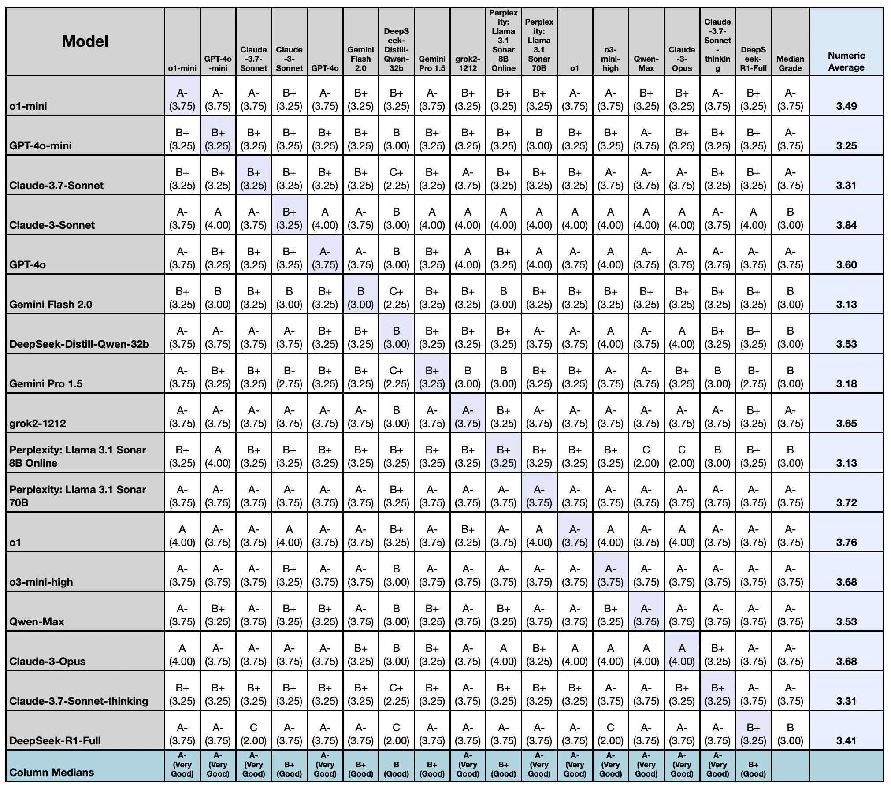

# Boswell Test: LLM Comparative Analysis Framework

The Boswell Test is an automated tool for comparing Large Language Models (LLMs) through peer-review, where models grade each other's essays. This implementation is based on the methodology introduced by Dr. Peter Luh in his article ["Is AI Chatbot My Boswell?"](https://peterl168.substack.com/p/is-ai-chatbot-my-boswell) (February 2025).

## Example grading report for essay questions as seen in the original article:


<!-- ## Example overall performance metrics: -->

<!--


## 🚀 New Modular Structure -->

This repository now features a fully modular architecture for better maintainability and extensibility. Full details are available in the [docs/technical/architecture.md](docs/technical/architecture.md) documentation.

**Key Improvements:**
- Clean package structure with separated concerns
- Response caching system to improve performance and reduce redundant API calls
- Enhanced reporting capabilities
- Domain creation utilities
- Expanded free model support with 12 additional LLMs
- Improved documentation and tooling
- Automatic Excel cross-assessment matrix generation (Table 1 format with median bias)

For detailed documentation, see the [docs/](docs/) directory.

## 🚦 Quick Start

Get up and running with the Boswell Test framework in minutes:

```bash
# Clone the repository
git clone https://github.com/referential.ai/boswell-test.git
cd botwell

# Create a virtual environment
python -m venv venv
source venv/bin/activate  # On Windows: venv\Scripts\activate

# Install the package
pip install -e .

# Set your API key
export OPENROUTER_API_KEY="your_api_key_here"

# Run a simple test with free models
botwell --domain pol_sci_1 --free

# Generate a summary report
botwell report --latest

botwell --domain pol_sci_1 --models "Qwen-Turbo" "Perplexity: Llama 3.1 Perplexity: Llama 3.1 Sonar 70B: Llama 3.1 Sonar 8B Online Online" "o3-mini-high" "Claude-3-Opus" "grok2-1212" "Perplexity: Llama 3.1 Perplexity: Llama 3.1 Sonar 70B: Llama 3.1 Perplexity: Llama 3.1 Sonar 70B" "grok-beta" "o1-mini"

# Generate cross-assessment Excel table with exact Table 1 styling from the paper
python create_cross_grading_table.py results/[timestamp]-[domain]/full_results.json
```

See [docs/usage/quick_start.md](docs/usage/quick_start.md) for more details and [docs/usage/advanced_usage.md](docs/usage/advanced_usage.md) for advanced usage scenarios.

## 🌟 Introduction: How It Works

This tool automates the process of running a Boswell Test across multiple LLMs. Here's how it works:

1. **Essay Generation**: The system prompts multiple LLMs with the same complex question in a specific domain (like political science or computer science)
2. **Peer Evaluation**: Each LLM grades the essays written by all other models, providing detailed feedback and assigning letter grades (A+, A, A-, etc.)
3. **Bias Analysis**: The system analyzes grading patterns to identify which models grade more strictly or leniently compared to the median
4. **Visualization**: The framework generates charts and graphs showing performance metrics, grading distributions, timing data, and Boswell Quotient rankings
5. **Comprehensive Reporting**: Results are organized in timestamped directories with easy-to-read tables in multiple formats (Markdown, ASCII, CSV, JSON)

The Boswell Test methodology offers several advantages over traditional benchmarks:
- It captures nuanced evaluation capabilities, not just raw performance
- It leverages LLMs' own analytical skills to provide detailed feedback
- It reveals biases in how different models evaluate the same work
- It creates a multidimensional view of model capabilities across different domains

All of this is automated through a simple command-line interface that handles the entire testing process from essay generation to final report creation.

## 🔍 What is the Boswell Test?

The Boswell Test works by:

1. **Prompting** multiple LLMs with a domain-specific question to get an essay response from each model
2. **Having** each model grade the essays produced by other models, providing detailed feedback and assigning letter grades
3. **Generating** comprehensive reports with both raw responses and statistical analysis of performance

This approach allows for a multi-dimensional evaluation that goes beyond simple benchmarks by leveraging the analytical capabilities of the models themselves.

## 📋 Available Domains

The framework includes multiple testing domains, each with different difficulty levels:

- **Political Science**
  - `pol_sci_1`: Level 1: AI policy analysis
  - `pol_sci_2`: Level 2: AI governance analysis with rigorous grading

- **Programming**
  - `programming_1`: Level 1: Coding Fundamentals
  - `programming_2`: Level 2: Advanced Algorithms
  - `programming_3`: Level 3: Competitive Programming Challenges

- **Humanities**
  - `humanities_1`: Level 1: Social Philosophy

- **Computer Science**
  - `comp_sci_1`: Level 1: Algorithm analysis and complexity
  - `comp_sci_2`: Level 2: System design for distributed applications

## 🛠️ Setup

### Prerequisites

- Python 3.8+
- OpenRouter API key (get one at [OpenRouter.ai](https://openrouter.ai/))

### Installation

1. **Clone the repository**:
   ```bash
   git clone https://github.com/alanwilhelm/botwell.git
   cd botwell
   ```

2. **Create a virtual environment**:
   ```bash
   python -m venv venv
   ```

3. **Activate the environment**:
   - On macOS/Linux:
     ```bash
     source venv/bin/activate
     ```
   - On Windows:
     ```bash
     venv\Scripts\activate
     ```

4. **Install dependencies**:
   ```bash
   # Either install dependencies directly
   pip install -r requirements.txt
   # Or install as a package (recommended): pip install -e .
   ```

5. **Set your OpenRouter API key**:
   ```bash
   export OPENROUTER_API_KEY="your_api_key_here"
   ```

## 🚀 Usage

### Basic Usage

Run a test with default settings:

```bash
botwell
```

This uses the newly added command-line interface that provides a simpler way to run tests and manage the framework.

This will run the basic political science test with all verified models.

### Advanced Usage

#### Select a specific domain:

```bash
botwell --domain pol_sci_2
```

#### Run tests on all available domains:

```bash
botwell --all-domains
```

This will sequentially run tests on all domains with the same set of models, creating separate results directories for each domain. When multiple domains are tested, it will also generate:

1. Visualizations comparing model performance across domains
2. Detailed reports identifying which models are consistent across domains vs. specialized in specific areas

#### Use specific models:

```bash
botwell --models "Qwen-Turbo" "Claude-3-Opus" "o3-mini-high"
```

#### Combine options:

```bash
botwell --all-domains --models "Qwen-Turbo" "o3-mini-high" --skip-verification
```

#### Expire or clear the cache:

```bash
# Expire old cache entries only
botwell cache clear --expired-only
```

#### Run a comprehensive model cross-assessment:

```bash
# Run with the top-performing premium models mentioned in the research
botwell --domain pol_sci_1 --models "GPT-4o" "GPT-4o-mini" "Claude-3.7-Sonnet" \
"Claude-3-Sonnet" "Claude-3-Opus" "Claude-3.7-Sonnet-thinking" "Gemini Pro 1.5" "Gemini Flash 2.0" \
"o1" "o1-mini" "o3-mini-high" "Qwen-Max" "grok2-1212" "DeepSeek-R1-Full" \
"DeepSeek-Distill-Qwen-32b" "Perplexity: Llama 3.1 Sonar 70B" "Perplexity: Llama 3.1 Sonar 8B Online"
```

#### Run with only free models:

```bash
botwell --domain pol_sci_1 --free
```

#### Note on accessing premium models:

```bash
# To access premium models, you'll need to pay for API credits on OpenRouter.ai
# Set your paid API key to access these models with: export OPENROUTER_API_KEY="your_paid_api_key_here"
```

#### Skip model verification (faster but less reliable):

```bash
botwell --skip-verification
```

#### Configure retry attempts for API calls:

```bash
botwell --max-retries 5
```

#### Custom output file (in addition to organized results directory):

```bash
botwell --output custom_results.json
```

### Model Management

#### Update local models file with available OpenRouter models:

```bash
botwell --update-models
```

This command fetches the current list of available models from OpenRouter's API and saves them to a local JSON file. The output includes model IDs, context lengths, pricing information, and descriptions.

#### Specify custom models file:

```bash
botwell --update-models --models-file my_models.json
```

### Cache Management
The Boswell Test includes cache management utilities to improve performance. The response caching system stores API responses to avoid redundant API calls, especially useful during development and testing.

```bash
# View cache statistics
botwell cache stats

# Clear the entire cache
botwell cache clear

# Clear only expired cache entries
botwell cache clear --expired-only
```

### Domain Creation
You can create new domain definitions easily with the built-in domain creation utility:

```bash
botwell create-domain
```

This interactive tool will guide you through creating a new domain with appropriate prompts for essay generation and grading.

### Report Generation

Reports can now be generated using the built-in report command rather than requiring a separate script execution. This simplifies the workflow and ensures all features are accessible through the same command interface.


Generate comprehensive summary reports from test results:

```bash
# Generate a report for the most recent test results
botwell report --latest

# Generate a report for a specific results directory
botwell report --directory results/20250301-145232-pol_sci_1

# Generate reports for all results directories
botwell report --all
```

### Information Commands

#### List available domains:

```bash
botwell --list-domains
```

#### List available models:

```bash
botwell --list-models

# List only free models
botwell --list-models --free
```

## 📊 Results Organization

The Boswell Test organizes results in a timestamped directory structure:

```
results/
├── 20240626-123456-pol_sci_1/     # Timestamped run directory with domain
│   ├── essays/                    # Individual essay files
│   │   ├── GPT-4o.md              # Essay with feedback from all graders
│   │   ├── Claude-3-Opus.md
│   │   └── ...
│   ├── charts/                    # Data visualizations
│   │   ├── grading_bias.png       # Bar chart of grading bias by model
│   │   ├── grade_distribution.png # Boxplot of grades received by each model
│   │   ├── essay_generation_time.png  # Time comparison for essay generation
│   │   ├── average_grading_time.png   # Time comparison for grading
│   │   ├── time_breakdown.png     # Pie chart of process timing
│   ├── grades_table.txt           # ASCII table of all grades
│   ├── grades_table.md            # Markdown table of all grades
│   ├── grades_table.csv           # CSV format for spreadsheet import
│   ├── grading_bias.txt           # ASCII table of grading bias analysis
│   ├── grading_bias.md            # Markdown table of grading bias analysis
│   ├── timing_report.md           # Detailed timing analysis report  
│   ├── grades.json                # Structured grade data in JSON
│   └── full_results.json          # Complete results with all data
├── 20240626-234567-aggregate/     # Aggregate analysis across all domains (when using --all-domains)
│   ├── charts/                    # Cross-domain visualizations
│   │   ├── aggregate_boswell_quotient.png  # Overall ranking across domains
│   │   └── domain_comparison.png  # How top models perform in each domain
└── ...
```

### Output Artifacts

#### 1. Essay Files (`essays/` directory)

Each essay file is a Markdown document named after the model that produced it, containing:
- The original essay from the model, labeled with the model name
- A "Grading Feedback" section with feedback from each grader
- Letter and numeric grades for each evaluation
- Clear attribution of which model gave which feedback

Example content:
```markdown
# Essay by Qwen-Turbo

[Original essay content...]

---

# Grading Feedback

## Graded by: Claude-3-Opus

[Detailed feedback from Claude-3-Opus...]

**Letter Grade:** A-
**Numeric Grade:** 3.7

---

## Graded by: o3-mini-high

[Detailed feedback from o3-mini-high...]

**Letter Grade:** B+
**Numeric Grade:** 3.3

---
```

#### 2. Grade Tables (multiple formats)

**ASCII Table** (`grades_table.txt`):
```
Model     | Qwen-T | Claude | o3-mini | Median |
----------|--------|--------|----------|--------|
Qwen-T    |  ---   |   A-   |    A     |   A-   |
Claude    |   B+   |  ---   |    A-    |   B+   |
o3-mini   |   A    |   B+   |   ---    |   A-   |
```

**Markdown Table** (`grades_table.md`):
| Model | Qwen-T | Claude | o3-mini | Median Grade |
|-------|--------|--------|----------|--------------|
| Qwen-T | --- | A- | A | A- |
| Claude | B+ | --- | A- | B+ |
| o3-mini | A | B+ | --- | A- |


**CSV Table** (`grades_table.csv`):
```csv
Model,Qwen-T,Claude,o3-mini,Median Grade
Qwen-T,---,A-,A,A-
Claude,B+,---,A-,B+
o3-mini,A,B+,---,A-
```

#### 3. Grading Bias Analysis

The framework analyzes each model's grading tendencies to identify which models are stricter or more lenient graders:

**ASCII Table** (`grading_bias.txt`):
```
Model     | Median Given | Grading Bias          |
----------|--------------|------------------------|
Qwen-T    |      A-      | Lenient (+1/3 grade)  |
Claude    |      B       | Slightly Strict (-1/3) |
o3-mini   |      B+      | Neutral               |
----------|--------------|------------------------|
OVERALL   |      B+      | Baseline              |
```

**Markdown Table** (`grading_bias.md`):
| Model | Median Given | Grading Bias | Numeric Bias |
|-------|-------------|-------------|-------------|
| Qwen-T | A- | Lenient (+1/3 grade) | 0.33 |
| Claude | B | Slightly Strict (-1/3 grade) | -0.33 |
| o3-mini | B+ | Neutral | 0.0 |
| **OVERALL** | B+ | **Baseline** | 0.00 |

This analysis helps identify potential biases in how different models evaluate the same content. For example, some models might consistently grade more strictly or leniently than others.


#### 4. Data Visualizations (`charts/` directory)

The Boswell Test generates several data visualizations to help analyze the results:

**Grading Bias Chart** (`grading_bias.png`):
A bar chart showing which models grade more strictly or leniently compared to the median. Negative values indicate stricter graders, while positive values show more lenient ones.

**Grade Distribution** (`grade_distribution.png`):
A boxplot showing the distribution of grades received by each model, making it easy to see both the median grade and the spread of opinions about each model's performance.

**Essay Generation Time** (`essay_generation_time.png`):
A horizontal bar chart comparing how long each model took to generate its essay, sorted from fastest to slowest.

**Average Grading Time** (`average_grading_time.png`):
A horizontal bar chart showing the average time each model took to grade essays from other models.

**Process Timing** (`time_breakdown.png`):
A pie chart showing the proportion of time spent on each phase of the test: essay generation, grading, analysis, and file generation.

**Cross-Assessment Excel Table** (`cross_grading_table.xlsx`):
An Excel spreadsheet containing the complete cross-assessment matrix (Table 1) with color highlighting, showing how each model grades every other model. The table includes the median bias data as the last row, matching the format shown in the research paper.

These visualizations provide at-a-glance insights into model performance, efficiency, and cost-effectiveness across the different test aspects.

#### 5. Aggregate Analysis (Cross-Domain)


#### 5. Aggregate Boswell Analysis (Cross-Domain)

When running tests across multiple domains (`--all-domains`), the framework also generates a cross-domain analysis that identifies models' strengths and weaknesses across different subject areas:

**Aggregate Report Structure**:
- **Top Performing Models**: Analysis of models that excel across all domains
- **Domain-Specific Leaders**: Table showing which models performed best in each domain
- **Key Insights**: Analysis of consistent performers vs. domain specialists
- **Consistency Metrics**: Scores showing how uniformly models perform across domains
- **Conclusion**: Identification of the most adaptable, versatile AI assistants

This cross-domain analysis is particularly useful for identifying:
1. **Generalist models** that perform well across all types of tasks
2. **Specialist models** that excel in specific domains
3. **Consistency patterns** that show whether a model's capabilities transfer well between subjects

**JSON Grades** (`grades.json`):
```json
{
  "domain": {
    "name": "Political Science - Level 1: AI Policy Analysis",
    "description": "Level 1 evaluation of AI policy analysis capabilities."
  },
  "grades": {
    "GPT-4o": {
      "Claude": {"grade": "A-", "numeric_grade": 3.7, "feedback": "..."},
      "Claude-S": {"grade": "B+", "numeric_grade": 3.3, "feedback": "..."}
    },
    "Claude": {
      "GPT-4o": {"grade": "A", "numeric_grade": 4.0, "feedback": "..."},
      "Claude-S": {"grade": "A-", "numeric_grade": 3.7, "feedback": "..."}
    }
  },
  "summary": {
    "GPT-4o": {"median_numeric": 3.3, "grades_received": ["A-", "B+"]},
    "Claude": {"median_numeric": 3.7, "grades_received": ["A", "A-"]}
  },
  "bias_analysis": {
    "overall_median": 3.5,
    "grader_bias": {
      "GPT-4o": {"median_given": 4.0, "median_bias": 0.5, "letter_bias": "Lenient (+1 grade)"},
      "Claude": {"median_given": 3.5, "median_bias": 0.0, "letter_bias": "Neutral"}
    }
  },
  "run_timestamp": "2025-03-05 13:08:51"
}
```

#### 5. Full Results (`full_results.json`)

A comprehensive JSON file containing:
- All essays from each model
- Complete grading feedback and grades
- Statistical analysis of performance
- Run metadata (timestamp, models used, domain info)
- File paths to all generated artifacts
- Timing data for all operations

This file contains everything needed to reconstruct the entire test session.

## 📈 Latest Results (March 2025)

### Performance Grades

Below are results from a recent Boswell Test run in the Political Science domain (AI Policy Analysis - March 2025), showing median grades for each model:

| Model                                  | Median Grade | Sample of Grades Received                 |
|----------------------------------------|--------------|-------------------------------------------|
| GPT-3.5-Turbo                          | B+           | A, A-, B+, B, B+, B-, B, B-, B+, A-       |
| Llama-3-8B                             | B+           | A, B+, B-, B-, C+, B, B-, B, B+, A        |
| GPT-4o-mini                            | B+           | A-, A, B+, B, B+, B-, A-, B+, B, A-       |
| GPT-4o                                 | B+           | A, A-, B+, B, B+, B-, A-, B+, B, A-       |
| Claude-3-Opus                          | B+           | A, B+, B+, B+, B, A-, B+, B+, B-, A-      |
| Claude-3-Sonnet                        | B+           | A, A, B+, B+, B, B-, B+, B, B-, A-        |
| Claude-3.7-Sonnet                      | A-           | A-, B+, A-, B+, A-, B+, A-, B+, A-, A     |
| Claude-3.7-Sonnet-thinking             | A-           | A-, B-, A-, B+, A-, B+, A, B+, B+, A      |

### Latest Grading Results (March 2025)

| Model                                  | Median Grade | Raw Average | Notable Grades                            |
|----------------------------------------|--------------|-------------|-------------------------------------------|
| o1-mini                                | A-           | 3.63        | A (93.00), A- (90.00), B+ (87.00)         |
| GPT-4o-mini                            | A-           | 3.56        | A (93.00), A- (90.00), B+ (87.00)         |
| Claude-3.7-Sonnet                      | A-           | 3.44        | A- (90.00), B+ (87.00), C (73.00)         |
| Claude-3-Sonnet                        | B+           | 3.40        | A (93.00), A- (90.00), B+ (87.00)         |
| GPT-4o                                 | A-           | 3.53        | A (93.00), A- (90.00), B+ (87.00)         |
| Gemini Flash 2.0                       | B+           | 3.47        | A- (90.00), B+ (87.00), B (83.00)         |
| DeepSeek-Distill-Qwen-32b              | B            | 2.82        | B+ (87.00), B (83.00), C+ (77.00)         |
| Gemini Pro 1.5                         | B+           | 3.47        | A (93.00), A- (90.00), B+ (87.00)         |
| grok2-1212                             | A-           | 3.56        | A (93.00), A- (90.00), B+ (87.00)         |
| Perplexity: Llama 3.1 Sonar 8B Online  | B+           | 3.43        | A (93.00), A- (90.00), B+ (87.00)         |
| Perplexity: Llama 3.1 Sonar 70B        | A-           | 3.54        | A (93.00), A- (90.00), B+ (87.00)         |
| o1                                     | A-           | 3.60        | A (93.00), A- (90.00), B+ (87.00)         |
| o3-mini-high                           | A-           | 3.60        | A (93.00), A- (90.00), C (73.00)          |
| Qwen-Max                               | A-           | 3.62        | A (93.00), A- (90.00), C (73.00)          |
| Claude-3-Opus                          | A-           | 3.56        | A (93.00), A- (90.00), C (73.00)          |
| Claude-3.7-Sonnet-thinking             | A-           | 3.49        | A- (90.00), B+ (87.00), B (83.00)         |
| DeepSeek-R1-Full                       | B+           | 3.47        | A (93.00), A- (90.00), B- (80.00)         |

Additionally, the system now supports many more free models, including:

|                                        |              |                                           |
|----------------------------------------|--------------|-------------------------------------------|
| GPT-3.5-Turbo                          | B+           | A, A-, B+, B, B+, B-, B, B-, B+, A-       |
| Llama-3-8B                             | B+           | A, B+, B-, B-, C+, B, B-, B, B+, A        |
| GPT-4o-mini                            | B+           | A-, A, B+, B, B+, B-, A-, B+, B, A-       |
| GPT-4o                                 | B+           | A, A-, B+, B, B+, B-, A-, B+, B, A-       |
| Claude-3-Opus                          | B+           | A, B+, B+, B+, B, A-, B+, B+, B-, A-      |
| Claude-3-Sonnet                        | B+           | A, A, B+, B+, B, B-, B+, B, B-, A-        |
| Claude-3.7-Sonnet                      | A-           | A-, B+, A-, B+, A-, B+, A-, B+, A-, A     |
| Claude-3.7-Sonnet-thinking             | A-           | A-, B-, A-, B+, A-, B+, A, B+, B+, A      |
| Gemini Flash 1.5                       | B+           | A-, B+, B+, B, B+, B, A-, B+, B+, A-      |
| Gemini Pro 1.5                         | B+           | A, B+, B+, B, B+, B+, A-, B-, B+, A-      |
| o1                                     | A-           | A-, A+, B, B+, A-, B+, A-, B+, A-, A      |
| o1-mini                                | B+           | A, B+, A-, B, B+, B+, A, B+, B+, A-       |
| o3-mini-high                           | B+           | A, B+, A-, A-, A-, B+, A-, B+, B+, A-     |

New free models available include:
- Meta: Llama 3.1 8B Instruct
- Meta: Llama 3.3 70B Instruct
- Meta: Llama 3.2 1B Instruct
- NVIDIA: Llama 3.1 Nemotron 70B Instruct
- Mistral: Mistral Small 3
- Mistral: Mistral Nemo
- DeepSeek: R1
- Moonshot AI: Moonlight 16b Instruct
- Nous: DeepHermes 3 Llama-3-8B Preview
- Google: Gemini models (Flash Lite 2.0 Preview, Pro 2.0 Experimental)


### Adding New Models

Edit the `MODELS` list in `boswell_test.py` to add or remove models from OpenRouter. The script is pre-configured with models known to work with OpenRouter. If you want to try additional models:

1. Check the available models on [OpenRouter](https://openrouter.ai/models)
2. Add them to the `MODELS` list in the format `{"name": "Model-Name", "model_id": "provider/model-id"}`
3. The model verification step will automatically filter out any models that aren't available

## 📊 Performance Considerations

The Boswell Test framework is optimized for efficient operation with multiple models:

- **Concurrent Processing**: Parallel execution of model verification, essay generation, and grading significantly reduces overall runtime
- **Thread Safety**: Proper locking mechanisms prevent race conditions when updating shared data
- **Resource Management**: The framework is optimized for I/O-bound operations and efficiently manages multiple concurrent API calls
- **Scalability**: Successfully tested with 20+ models running in parallel
- **Comprehensive Results**: A full run generates detailed analysis and visualizations for in-depth insights

You can customize the test scope for specific needs:
- Run tests on a single domain for targeted analysis
- Select a specific subset of models to test
- Use the `--skip-verification` flag to bypass the model verification step
- Leverage the caching system to avoid redundant API calls

## 📝 License

[MIT License](LICENSE)

## 🙏 Acknowledgments

- **Peter Luh** who created the [Boswell Test methodology](https://peterl168.substack.com/p/is-ai-chatbot-my-boswell) that this tool implements. His February 2025 research article, "Is AI Chatbot My Boswell?", introduced the concept of LLMs peer-reviewing each other and analyzing grading bias. This implementation automates and extends his pioneering methodology.
- [OpenRouter](https://openrouter.ai/) for providing unified API access to multiple LLMs
- All model providers for creating the amazing AI models that make this test possible
