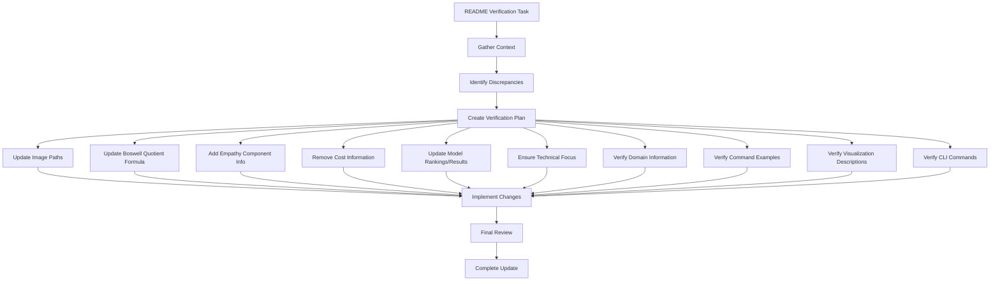

# README Verification and Update Plan

## Overview
This document outlines the plan for verifying and updating the Boswell Test README.md file to ensure it accurately reflects the current implementation of the framework, with a focus on making it more technical and removing cost-related information.

## Verification Diagram

## Detailed Verification Steps

### 1. Image Paths
- **Current:** References to images in `results/20250304-193440-aggregate/`
- **Action:** Update to reference the current directory: `results/20250304-194506-aggregate/`
- **Examples to Update:**
  - Line 5: ``
  - Line 7: ``

### 2. Boswell Quotient Formula
- **Current:** Formula described with 50% Performance, 30% Evaluation, 20% Efficiency weights
- **Updated Formula:** Equal 25% weighting across all four components
  - Performance (25%)
  - Evaluation (25%)
  - Efficiency (25%) 
  - Empathy (25%)
- **Sections to Update:**
  - Description of the Boswell Quotient in the Introduction section
  - Calculation Components section
  - "How it's Calculated" section

### 3. Empathy Component Addition
- **Action:** Add information about the new Empathy component throughout the README
- **Key areas for addition:**
  - Introduction section
  - Boswell Quotient explanation sections
  - Component breakdown visualizations section
  - Results and rankings sections
- **Description to Add:** The Empathy component (25%) evaluates a model's ability to respond empathetically to emotional scenarios, measuring across four dimensions: emotion acknowledgment, validation, perspective-taking, and support.

### 4. Remove Cost Information
- **Action:** Remove or significantly reduce cost-related sections
- **Sections to Remove/Reduce:**
  - Cost Analysis Report section
  - Cost and Performance Considerations section
  - Any other scattered cost references throughout the document

### 5. Update Model Rankings and Results
- **Action:** Update all statistics, scores, and rankings to match latest results in aggregate_boswell_quotient.json
- **Areas to Update:**
  - The table in the Performance Grades section
  - The Grading Bias Analysis section
  - The Timing and Performance Metrics section
  - The Boswell Quotient Rankings section

### 6. Technical Focus Enhancement
- **Action:** Review the entire document to ensure language is technical and suitable for an academic audience
- **Areas to Focus On:**
  - Add more technical details about the implementation
  - Emphasize the methodology and theoretical framework
  - Use more precise technical language
  - Remove marketing-like language

### 7. Verify Domain Information
- **Action:** Check that the information about available domains is accurate
- **Section to Verify:** Available Domains section
- **Data Source:** Compare with domains listed in aggregate_boswell_quotient.json

### 8. Command Examples Verification
- **Action:** Verify all command examples against the actual implementation
- **Sections to Check:**
  - Quick Start
  - Usage sections
  - Report Generation
  - Other commands sections

### 9. Visualization Descriptions Verification
- **Action:** Ensure all described visualizations match what the code actually generates
- **Areas to Check:** 
  - Data Visualizations section
  - Compare chart descriptions with the visualizations.py implementation

### 10. CLI Commands Verification
- **Action:** Ensure all CLI command descriptions match the actual implementation
- **Sections to Check:**
  - Basic Usage
  - Domain Creation
  - Cache Management
  - Information Commands

## Implementation Strategy
1. Start with the most critical updates (BQ formula, Empathy component, image paths)
2. Work through the technical content updates
3. Remove cost information
4. Perform a final review to ensure consistency throughout the document

## Next Steps
- Switch to Code mode for implementation
- Review the changes line by line
- Make all necessary updates to the README.md file
- Create a pull request with the changes