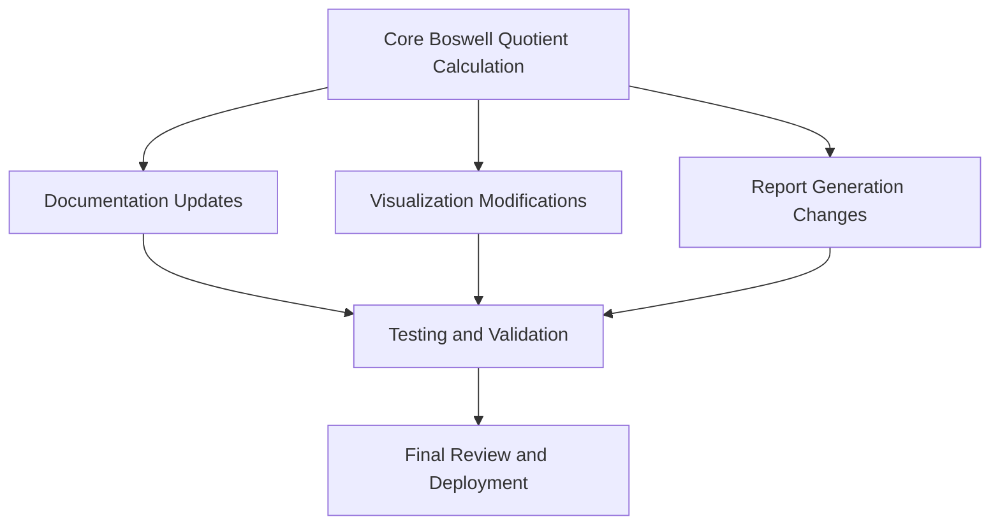
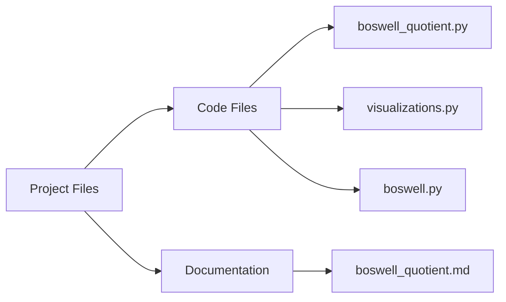
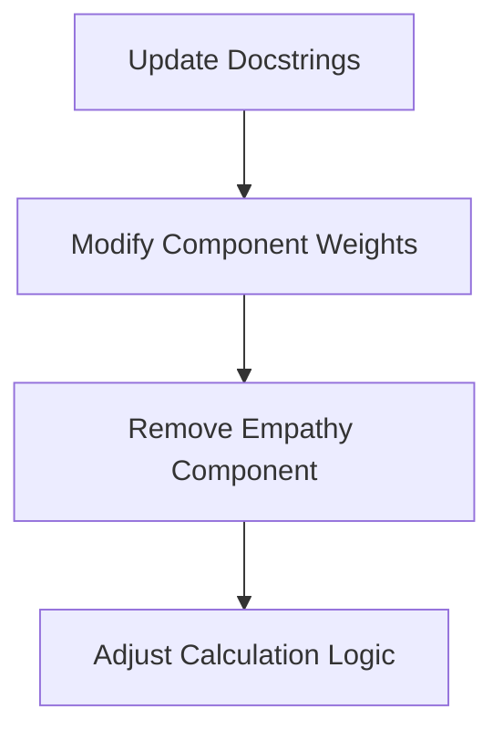
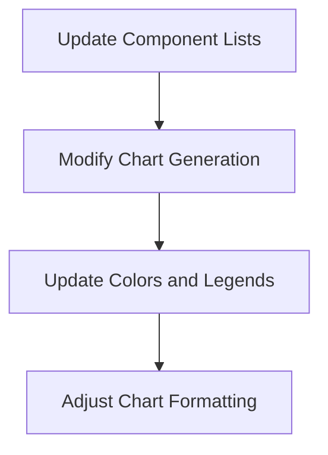
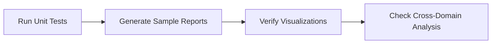
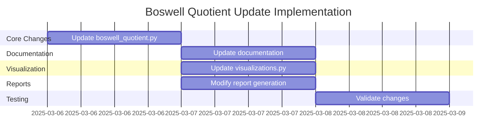

# Comprehensive Plan: Reverting to Original 3-Component Boswell Quotient

## 1. Overview of Changes

This plan outlines the necessary changes to revert the Boswell Quotient implementation to the original three-component system with equal weighting (33.3% each). This involves removing the Empathy component and adjusting the weights of the remaining components.

## 2. Files Requiring Modification

1. **Core Code:**
   - `botwell/reporting/boswell_quotient.py`
   - `botwell/reporting/boswell.py`
   - `botwell/reporting/visualizations.py`

2. **Documentation:**
   - `docs/functionality/boswell_quotient.md`

## 3. Detailed Implementation Plan

### 3.1 Core Calculation Update (`boswell_quotient.py`)

**Specific Changes:**
1. Update docstrings to reflect the 3-component system
2. Change component weights from 0.25 each to 0.333 (or 1/3) each
3. Remove references to empathy in component_weights dictionary
4. Remove code that processes empathy scores
5. Ensure the score calculation properly handles the absence of the empathy component

**Code Sections to Modify:**
- Lines 4-10: Update the module docstring
- Lines 18-26: Update the calculate_boswell_quotient docstring
- Lines 30-37: Modify component_weights dictionary
- Remove lines 150-155: Code related to empathy component
- Update normalization in final score calculation (lines 158-162)

### 3.2 Documentation Update (`boswell_quotient.md`)

**Specific Changes:**
1. Update component description to only include the three original components
2. Change component weights to 33.3% each
3. Update example output to show only 3 components
4. Remove all references to the empathy component

**Sections to Modify:**
- Introduction paragraph
- "What is the Boswell Quotient?" section
- "Calculation Components" section
- Sample Output section
- Interpretation guidelines (if needed)

### 3.3 Visualization Update (`visualizations.py`)

**Specific Changes:**
1. Remove "empathy" from the components list throughout the file
2. Update component_colors dictionary to only include three components
3. Modify the Boswell Quotient component breakdown chart generation
4. Update aggregate visualization generation to handle only 3 components
5. Adjust bar widths, positions, and spacing in charts

**Specific Code Sections:**
- Lines 220-221: Update components list
- Lines 224-226: Modify component data collection
- Line 238-242: Update component bar chart generation
- Lines 278-284: Update aggregate component visualization
- Line 338-343: Update component_colors dictionary

### 3.4 Report Generation Update (`boswell.py`)

**Specific Changes:**
1. Remove empathy from component_leaders dictionary (lines 34-39)
2. Update report introduction to describe only 3 components (lines 65-69)
3. Remove the Empathy component section (lines 150-159)
4. Modify the balanced models calculation to check only 3 components (lines 168-173)

**Key Report Sections to Update:**
- Introduction section describing Boswell Quotient
- Component analysis section
- Component leaders reporting
- Observations and insights

## 4. Testing and Validation

1. **Validation Tests:**
   - Run test calculation with mock data
   - Generate sample reports and verify formatting
   - Create visualizations and check appearance
   - Validate cross-domain analysis functionality

2. **Key Areas to Test:**
   - Correct calculation of Boswell Quotient with new weights
   - Proper handling of missing empathy component in existing data
   - Visual appearance of charts with only 3 components
   - Report text and structure reflecting the 3-component system

## 5. Implementation Considerations and Challenges

1. **Data Compatibility:**
   - Existing results with empathy scores need to be handled gracefully
   - Ensure backward compatibility with older result datasets

2. **Visual Adjustments:**
   - Charts will need color scheme adjustments with one fewer component
   - Bar widths and spacing will change in component breakdown charts

3. **Score Impact:**
   - Boswell Quotient values will change due to different weighting
   - Ensure reporting correctly reflects the new calculation method

## 6. Implementation Timeline

## 7. Next Steps

Once this plan is approved, the implementation will proceed by:

1. Making the code changes in the specified files
2. Updating documentation to reflect the new system
3. Testing the changes to ensure correctness
4. Deploying the updated system

The modified Boswell Quotient will better align with the original paper's three-component methodology while maintaining equal weighting between the components as requested.