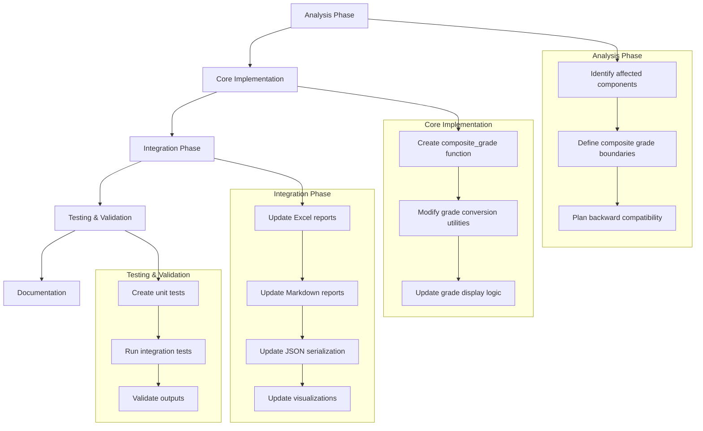

# Composite Grades Implementation Plan

## Overview

This plan outlines a comprehensive approach to implement composite grade notation in the Botwell grading system, addressing Peter's request for finer-grained grade distinctions like "A-/B+ for 3.5 or B+/B for 3.125" in the next paper.

## 1. Implementation Strategy



## 2. Analysis Phase

### 2.1 Affected Components

The following components will need modification:

1. **Core Grading Module**: `botwell/core/grading.py`
   - Grade conversion functions
   - Numeric/letter grade utilities

2. **Reporting Modules**:
   - `botwell/reporting/tables.py` - Table generation
   - `botwell/reporting/excel.py` - Excel report generation
   - `botwell/reporting/boswell_quotient.py` - BQ calculation

3. **Output Formats**:
   - Markdown tables
   - Excel spreadsheets
   - CSV files
   - JSON data

### 2.2 Composite Grade Boundaries

Define specific boundaries where composite grades will be used:

| Numeric Range | Composite Grade |
|---------------|----------------|
| 3.5 - 3.6     | A-/B+          |
| 3.1 - 3.15    | B+/B           |
| 2.85 - 3.0    | B/B-           |
| 2.5 - 2.6     | B-/C+          |
| 2.1 - 2.15    | C+/C           |
| 1.85 - 2.0    | C/C-           |
| 1.5 - 1.6     | C-/D+          |
| 1.1 - 1.15    | D+/D           |
| 0.85 - 1.0    | D/D-           |
| 0.35 - 0.5    | D-/F           |

The exact ranges need careful calibration to balance:
- Appropriate threshold sensitivity
- Consistency with university grading standards
- Clarity and usefulness of the composite grades

### 2.3 Backward Compatibility

Maintain backward compatibility:
- Keep existing grade_to_numeric() function unchanged
- Add new functions rather than modifying existing ones
- Ensure JSON serialization remains compatible with older versions
- Add feature flags to enable/disable composite grades if needed

## 3. Core Implementation

### 3.1 New Composite Grade Function in `botwell/core/grading.py`

```python
def get_composite_grade(numeric_grade: float) -> str:
    """
    Return appropriate grade notation, including composite grades for values
    between clear grade boundaries.
    
    Args:
        numeric_grade (float): The numeric grade value (0-4.25 scale)
        
    Returns:
        str: Standard grade or composite grade notation
    """
    # Standard grade boundaries
    grade_boundaries = {
        4.25: "A+", 4.0: "A", 3.75: "A-",
        3.25: "B+", 3.0: "B", 2.75: "B-",
        2.25: "C+", 2.0: "C", 1.75: "C-",
        1.25: "D+", 1.0: "D", 0.75: "D-",
        0.0: "F"
    }
    
    # Special case for N/A
    if numeric_grade <= 0.001:
        return "N/A"
    
    # Find surrounding grades
    sorted_boundaries = sorted(grade_boundaries.items(), reverse=True)
    
    for i in range(len(sorted_boundaries) - 1):
        upper_bound, upper_grade = sorted_boundaries[i]
        lower_bound, lower_grade = sorted_boundaries[i + 1]
        
        # If grade falls between two standard boundaries
        if lower_bound < numeric_grade < upper_bound:
            # Special case handlers for known composite grades
            if 3.45 < numeric_grade < 3.55:  # A-/B+ (3.5)
                return "A-/B+"
            elif 3.1 < numeric_grade < 3.15:  # B+/B (3.125)
                return "B+/B"
            # Add more special cases as needed
            
            # General case: If score is within 0.05 of the midpoint between grades
            midpoint = (upper_bound + lower_bound) / 2
            if abs(numeric_grade - midpoint) < 0.05:
                return f"{upper_grade}/{lower_grade}"
            
            # Otherwise return the closest grade
            return upper_grade if numeric_grade > midpoint else lower_grade
    
    # If we reach here, use standard grade mapping
    for bound, grade in sorted_boundaries:
        if numeric_grade >= bound:
            return grade
    
    # Fallback
    return "F"
```

### 3.2 Update Display Utilities

Add a helper function to convert raw scores to display format:

```python
def format_grade_with_score(grade: str, numeric_grade: float, use_composite: bool = True) -> str:
    """
    Format a grade for display, optionally using composite notation.
    
    Args:
        grade (str): The letter grade
        numeric_grade (float): The raw numeric score
        use_composite (bool): Whether to use composite grade notation
        
    Returns:
        str: Formatted grade string for display
    """
    if use_composite:
        # Use composite grade function if appropriate
        display_grade = get_composite_grade(numeric_grade)
    else:
        # Use standard grade
        display_grade = grade
        
    # Return combined format
    return f"{display_grade} ({numeric_grade:.2f})"
```

## 4. Integration Phase

### 4.1 Excel Reports Integration (`botwell/reporting/excel.py`)

Modify the Excel cell generation code:

```python
def update_excel_cell_with_grade(cell, grade, numeric_grade, use_composite=True):
    """Update Excel cell with properly formatted grade"""
    if use_composite and numeric_grade > 0:
        display_grade = get_composite_grade(numeric_grade)
    else:
        display_grade = grade
        
    # Format for display
    display_value = f"{display_grade} ({numeric_grade:.2f})"
    
    apply_cell_style(
        cell,
        value=display_value,
        alignment=CENTER_WRAP_ALIGNMENT,
        border=THIN_BORDER
    )
```

### 4.2 Tables Integration (`botwell/reporting/tables.py`)

Update table generation to use composite grades:

```python
def format_table_cell(grade, numeric_grade, use_composite=True):
    """Format a grade cell for tables"""
    if use_composite and numeric_grade > 0:
        display_grade = get_composite_grade(numeric_grade)
    else:
        display_grade = grade
        
    return f"{display_grade} ({numeric_grade:.2f})"
```

### 4.3 Command Line Option

Add a CLI flag to enable/disable composite grade notation:

```python
# In botwell/cli.py
parser.add_argument('--use-composite-grades', 
                   action='store_true',
                   help='Use composite grade notation (A-/B+) for intermediate values')
```

## 5. Testing & Validation

### 5.1 Unit Tests

Create comprehensive tests for the composite grade functionality:

```python
# In tests/test_unit.py
def test_composite_grade_function():
    """Test the composite grade function returns expected values"""
    # Test standard grades
    assert get_composite_grade(4.0) == "A"
    assert get_composite_grade(3.25) == "B+"
    
    # Test composite grades
    assert get_composite_grade(3.5) == "A-/B+"
    assert get_composite_grade(3.125) == "B+/B"
    
    # Test edge cases
    assert get_composite_grade(0.0) == "N/A"
    assert get_composite_grade(4.25) == "A+"
```

### 5.2 Integration Tests

Test full system outputs:

```python
# In tests/test_cli_commands.py
def test_composite_grades_in_reports():
    """Test that composite grades appear in reports when enabled"""
    # Run test with composite grades enabled
    result = run_cli_with_test_data(["run", "--domain", "test_domain_1", "--use-composite-grades"])
    
    # Verify outputs contain composite grades
    assert "A-/B+" in result.output
```

### 5.3 Visual Validation

Manually review generated reports to ensure:
- Composite grades are displayed correctly
- Formatting is consistent
- Tables are readable and well-formatted

## 6. Documentation

### 6.1 Update `docs/grading.md`

Add new section about composite grades:

```markdown
## Composite Grade Notation

Starting with version X.Y.Z, the system can display composite grade notation for scores that fall between traditional grade boundaries:

| Numeric Range | Composite Grade |
|---------------|----------------|
| 3.5           | A-/B+          |
| 3.125         | B+/B           |
| ...           | ...            |

This provides finer-grained distinction in grading and better represents scores that fall between traditional grade boundaries.

### Enabling Composite Grades

Use the `--use-composite-grades` flag when running tests:

```bash
botwell run --domain pol_sci_1 --use-composite-grades
```
```

### 6.2 Update README.md

Add mention of the new feature in the README.

## 7. Branch Management

1. Create feature branch: `git checkout -b feature/composite-grades`
2. Implement core functionality
3. Integrate with reporting systems
4. Write tests
5. Update documentation
6. Create PR for review

## 8. Future Enhancements

Future improvements could include:

1. **Configuration Options**:
   - Allow customization of composite grade boundaries
   - Support different grading scales

2. **Extended Visualization**:
   - Add special color coding for composite grades in Excel reports
   - Create histograms showing grade distribution with composite grades

3. **Advanced Analytics**:
   - Analyze whether models tend to give composite grades more than others
   - Identify patterns in composite grade assignments