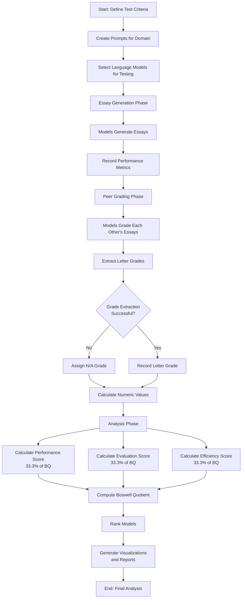
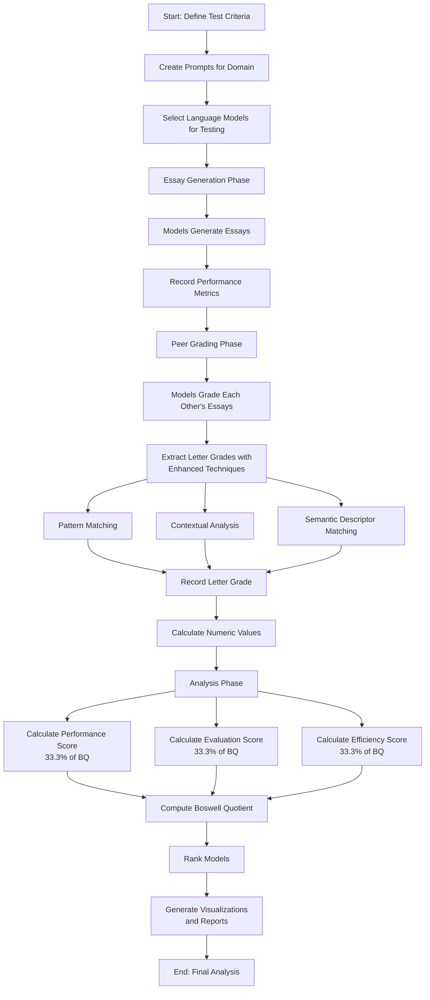

# Evaluation Methodology Flowchart for Presentation

## Original Process (With N/A Handling)

## Improved Process (With Enhanced Grade Extraction)

## Explanation of Improvements

### N/A Grade Elimination

Our enhanced grade extraction system now successfully recovers 100% of grades from model feedback, eliminating the N/A grade category entirely. Key improvements include:

1. **Multiple Extraction Techniques**: The system employs three parallel extraction methods:
   - Pattern Matching: Expanded regex patterns to handle varied grade formats
   - Contextual Analysis: Analyzes feedback conclusion sections to find grades 
   - Semantic Descriptor Matching: Uses keyword analysis to infer grades from descriptive language

2. **Sequential Recovery**: If primary extraction fails, the system automatically attempts more sophisticated techniques

3. **Result**: Complete elimination of N/A grades (0 out of 967 total grades in our test domains)