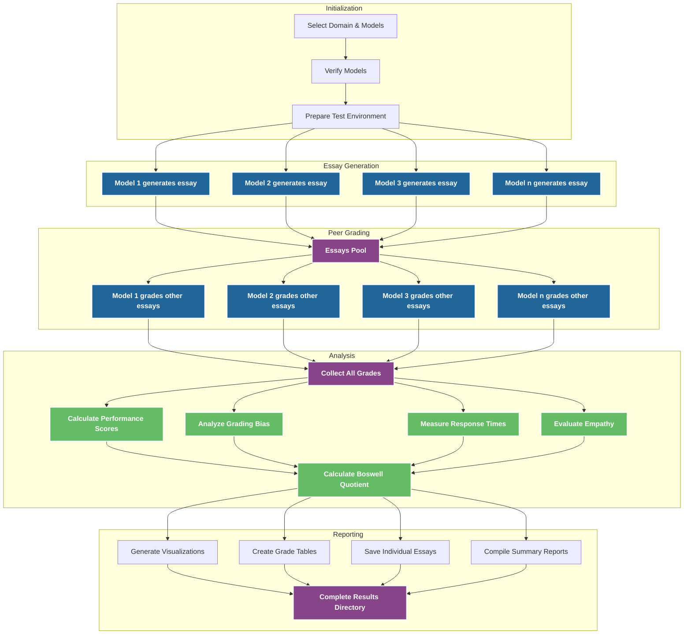
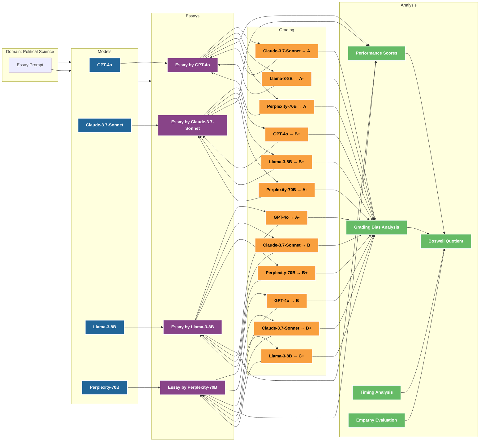
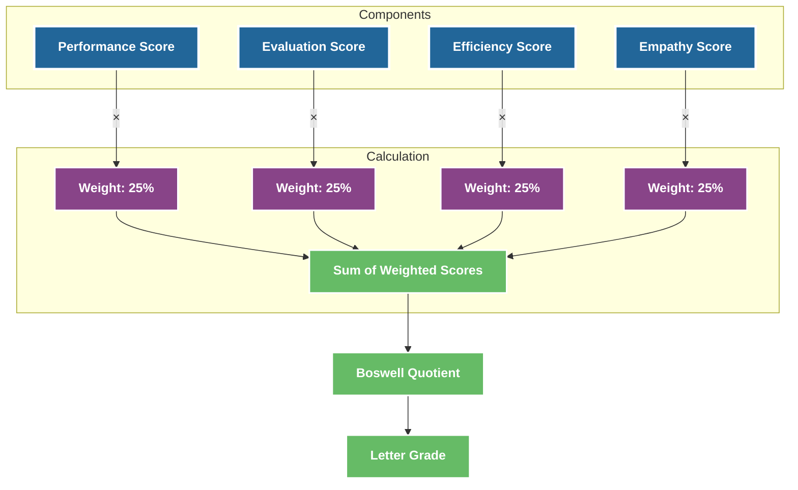

# Model Interaction Diagram

This document visualizes how models interact within the Boswell Test framework.

## Boswell Test Workflow

The diagram below illustrates the process flow of the Boswell Test, showing how models generate essays, grade each other's work, and how the system analyzes the results.

## Model Interaction Detail

This diagram shows the interactions between specific models in a test scenario, illustrating the peer review process.

## Boswell Quotient Calculation

This diagram illustrates how the Boswell Quotient is calculated from the four component scores.

These diagrams provide a visual representation of how models interact in the Boswell Test framework, illustrating the peer review process and result calculation methods.