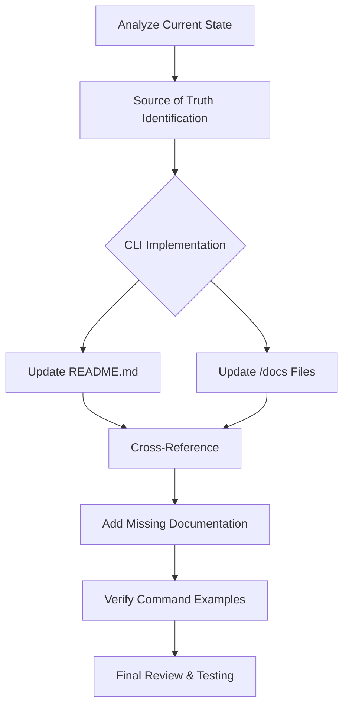

# Documentation Alignment Plan: Botwell

## Overview

This document outlines the plan to ensure consistency between the main README.md and the documentation in the `/docs` directory of the Botwell project, particularly focusing on command usage and functionality descriptions.

## Identified Inconsistencies

### 1. Command Structure Discrepancies

| Feature | Main README Format | Docs Format | Actual CLI Implementation |
|---------|-------------------|------------|---------------------------|
| Report Generation | `botwell report --latest` | `python generate_summary_report.py --latest` | `botwell report --latest` |
| Cache Management | `botwell cache stats/clear` | `python cache_manager.py stats/clear` | `botwell cache stats/clear` |
| Domain Creation | `botwell create-domain` | `python create_domain.py new_domain --interactive` | `botwell create-domain` |

### 2. Content Issues

- The `models.md` file is referenced in quick_start.md but doesn't exist
- Some documentation doesn't reflect the modular architecture described in architecture.md
- Domain descriptions in domains.md don't exactly match the main README
- Some features mentioned in README aren't documented in the `/docs` directory
- Inconsistent command examples across documentation files

## Documentation Alignment Workflow

## Implementation Plan

### Phase 1: Source of Truth Identification
1. Confirm that botwell/cli.py is the definitive implementation
2. Extract the complete command list and structure from cli.py
3. Create a reference table of all commands with their correct format, options, and descriptions

### Phase 2: README.md Verification
1. Review all command examples in README.md 
2. Ensure all commands match the current CLI implementation
3. Check that all documented features match the actual functionality
4. Update any outdated examples or descriptions

### Phase 3: /docs Directory Updates
1. Update quick_start.md:
   - Correct all command examples
   - Fix the reference to non-existent models.md
   - Ensure installation and configuration steps match README.md

2. Update advanced_usage.md:
   - Correct all command examples
   - Ensure all advanced features match the CLI implementation
   - Update the essay synthesis section with current parameters

3. Update domains.md:
   - Ensure domain descriptions match README.md
   - Correct domain creation commands
   - Verify domain structure descriptions

4. Update technical/caching.md:
   - Correct cache management commands
   - Ensure technical details match current implementation

### Phase 4: Add Missing Documentation
1. Create any missing reference documentation
2. Ensure documentation exists for all CLI features mentioned in README.md
3. Add examples for newer features (essay synthesis, etc.)

### Phase 5: Command Testing & Verification
1. Create a comprehensive test suite for all documented commands
2. Verify that each command works as documented
3. Update documentation for any commands that behave differently than described

## Quality Assurance Approach

For each documentation update:
1. **Consistency Check**: Ensure the same command format is used across all files
2. **Accuracy Check**: Verify against actual CLI implementation
3. **Completeness Check**: Ensure all features are documented 
4. **Cross-References**: Ensure links between documents are correct
5. **Example Testing**: Test example commands to confirm they work

## Success Criteria

- All command examples in documentation match the current CLI implementation
- All feature descriptions are accurate and consistent across all documentation
- All cross-references between documents are correct
- All examples work when executed as written
- Documentation structure is logical and easy to navigate

## Deliverables

1. Updated README.md with correct command examples
2. Updated documentation files in the /docs directory:
   - quick_start.md
   - advanced_usage.md
   - domains.md
   - technical/caching.md
3. New documentation files for any missing features
4. Command reference table for future maintenance