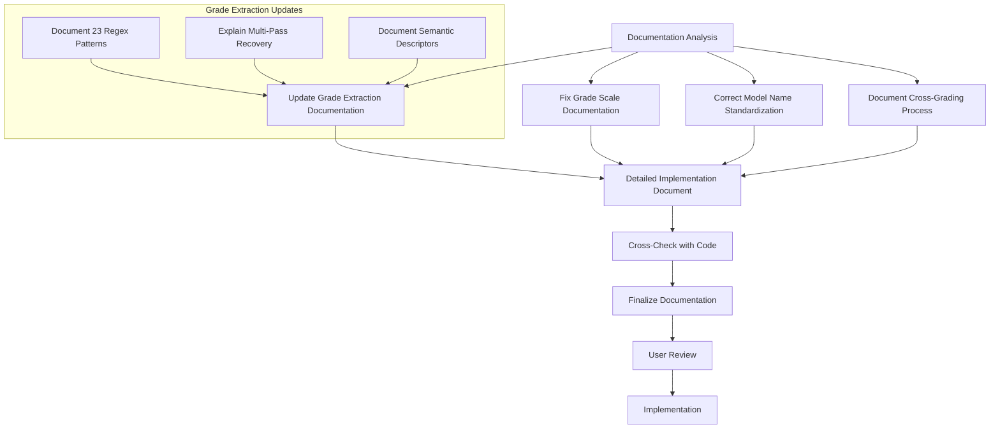

# Documentation Update Plan for Boswell Test Framework

## Overview
This document outlines the plan for updating the Boswell Test Framework documentation to accurately reflect the current implementation in the codebase. The primary goal is to ensure that all documentation in the `docs/` directory correctly describes the actual functionality of the code, with special attention to the `grading.md` overview.

## Primary Documentation Issues

### 1. Grade Extraction Documentation vs. Implementation
- **Issue**: The documentation in `grading.md` shows a simplified extraction method, while the actual implementation in `botwell/core/grading.py` uses 23+ regex patterns and multiple fallback strategies.
- **Observations**:
  - Current docs show only basic pattern matching for grades
  - Implementation includes multi-pass recovery strategy
  - Implementation uses semantic descriptor matching as a last resort
  - Complex fallback logic not reflected in documentation

### 2. Grade Scale Inconsistencies
- **Issue**: Different modules use different grade scales, which is not clearly documented.
- **Observations**:
  - `grading.md` uses scale where A+ = 4.25
  - `excel.py` uses a different GPA scale where A+ = 4.0 (same as A)
  - Conversion between scales not documented

### 3. Model Name Standardization Documentation
- **Issue**: `docs/model_name_standardization.md` contains errors and doesn't match the implementation.
- **Observations**:
  - Contains errors in model names (particularly Perplexity models)
  - Duplicated text in some model names
  - Documentation doesn't match implementation in `botwell/utils/model_standardization.py`

### 4. Cross-Grading Table Process
- **Issue**: Excel table generation process is not fully documented.
- **Observations**:
  - Raw numeric average calculations not clearly explained
  - Styling and formatting decisions not documented
  - Formula usage not explicitly stated

## Implementation Plan



## Detailed Implementation Steps

### 1. Update `grading.md`

#### Grade Extraction Documentation
- Document all 23 regex patterns used in the actual implementation
- Explain the pattern matching priority and order
- Document the multi-pass recovery strategy for grades
- Add details about the semantic descriptor approach:
  ```python
  grade_descriptors = {
      "A+": ["exceptional", "outstanding", "excellent", "superb", "flawless", "perfect"],
      "A": ["excellent", "superior", "exceptional", "outstanding", "remarkable"],
      # ... other grades and their descriptors
  }
  ```
- Include realistic examples showing the fallback mechanisms

#### Grade Scale Documentation
- Clarify the university standard letter grade scale used throughout the system
- Explain when different numeric scales are used (4.25 vs 4.0 for A+)
- Document the conversion logic between scales if applicable
- Update display precision information to match actual output formats

### 2. Fix `model_name_standardization.md`
- Correct all model names, especially Perplexity models:
  - Remove duplicated phrases like "Perplexity: Llama 3.1 Perplexity: Llama 3.1 Sonar 70B: Llama 3.1 Perplexity: Llama 3.1 Sonar 70B"
  - Ensure names match the `STANDARD_MODEL_NAMES` set in the code
- Update the examples section to demonstrate correct usage
- Ensure documentation reflects the actual standardization logic used in the code

### 3. Document Cross-Grading Table Generation
- Explain how Excel tables are generated
- Detail the column structure and data sources
- Document how raw numeric averages are calculated
- Explain the styling choices (colors, borders, fonts)
- Include a section about handling edge cases (N/A grades, empty data)

### 4. Additional Documentation Updates
- Ensure cross-references between documents are accurate
- Verify that code examples match actual implementation
- Update any outdated references to functionality that has changed

## Verification Process
Each documentation change will be compared against the actual code implementation to ensure accuracy. This includes:

1. Comparing function signatures and parameters
2. Verifying that examples match actual code behavior
3. Cross-checking numeric values and constants
4. Ensuring all fallback mechanisms are properly documented
5. Validating that output format descriptions match actual output

## Timeline
1. **Documentation Analysis**: Complete
2. **Documentation Updates Creation**: 1-2 days
3. **Cross-check with Code**: 1 day
4. **Implementation**: 1 day