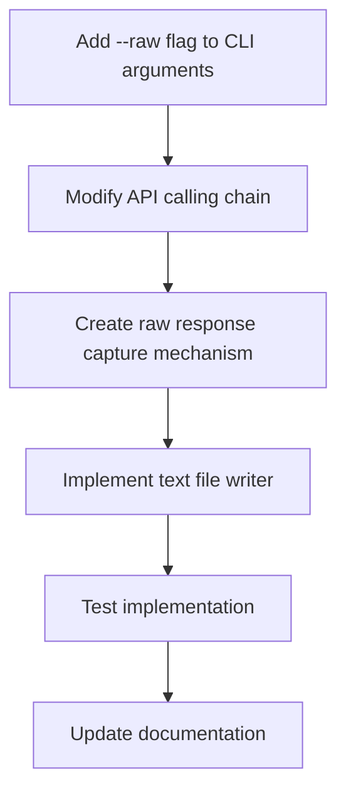

# Plan for Implementing the `--raw` Flag in Boswell Test CLI

Based on our information gathering and feedback, this document outlines the comprehensive plan to add the `--raw` flag to the Boswell Test CLI tool that will save raw API responses in a text format alongside normal processing.

## Overview and Requirements

- Add a `--raw` flag to the command line tool that accepts a filename parameter
- Save the raw API responses to the specified text file in a human-readable format
- Preserve all normal functionality while adding this capability
- Ensure this runs alongside normal operation (not replacing anything)

## Implementation Plan



### Detailed Steps

#### 1. Command Line Interface Modification

In `botwell/cli.py`:
- Add a new command-line argument `--raw` that accepts a filename parameter
- Pass this filename to the `run_boswell_test` function
- Handle the case when the parameter is not provided (raw output disabled)

Example implementation:
```python
parser.add_argument("--raw", type=str, metavar="FILE",
                   help="Save raw API responses to specified text file")
```

#### 2. API Call Modification

In `botwell/models/api.py`:
- Modify the `call_openrouter_api` function to accept an optional parameter for the raw output file
- When this parameter is provided, capture and format the raw response
- Implement a mechanism to write to the output file in a thread-safe manner

Key considerations:
- Thread-safety for concurrent API calls
- Proper file handling (opening, writing, closing)
- Appropriate error handling

#### 3. Test Runner Modification

In `botwell/core/test.py`:
- Modify `run_boswell_test` to accept and pass through the raw output filename
- Pass the parameter to all API calls
- Ensure that the raw file writer is properly initialized and closed

Implementation notes:
- Ensure the raw file parameter is passed through all necessary function calls
- Handle file initialization at the beginning of the test run
- Properly close the file at the end of the test

#### 4. Raw Output Format

Create a human-readable text format that includes:
- Timestamps for each API call
- Model information
- Request type (essay generation or grading)
- Prompt sent to the model
- Complete raw response from OpenRouter

Format example:
```
==== API CALL: 2025-03-11 10:15:30 ====
MODEL: Claude-3.7-Sonnet
TYPE: Essay Generation
PROMPT:
[Full prompt text here]

RESPONSE:
[Full raw API response text here]

==== END OF RESPONSE ====

```

## Files to Modify

1. `botwell/cli.py`
   - Add the new command-line argument
   - Modify main function to pass the parameter

2. `botwell/models/api.py`
   - Add raw output functionality to `call_openrouter_api`
   - Implement the text formatting and file writing mechanism

3. `botwell/core/test.py`
   - Update function signatures to accept and pass the raw output filename
   - Ensure thread-safe handling of the raw output file

## Implementation Considerations

1. **File Management**:
   - Open the file in append mode to allow accumulating responses
   - Implement proper file handling (open/close)
   - Handle file system errors gracefully

2. **Text Formatting**:
   - Ensure response formatting is easy to read and search
   - Use clear separators between API calls
   - Include all relevant metadata

3. **Performance Impact**:
   - Minimize impact on normal operation
   - Ensure file I/O doesn't slow down the main processing

## Testing Plan

1. Test the `--raw` flag with various file paths
2. Verify that raw API responses are correctly captured and written
3. Ensure that normal processing is not affected
4. Test with concurrent API calls to verify thread safety

## Documentation Updates

1. Update `docs/command_reference.md` to include the new flag
2. Add examples of usage to relevant documentation
3. Include information about the format of the raw output file