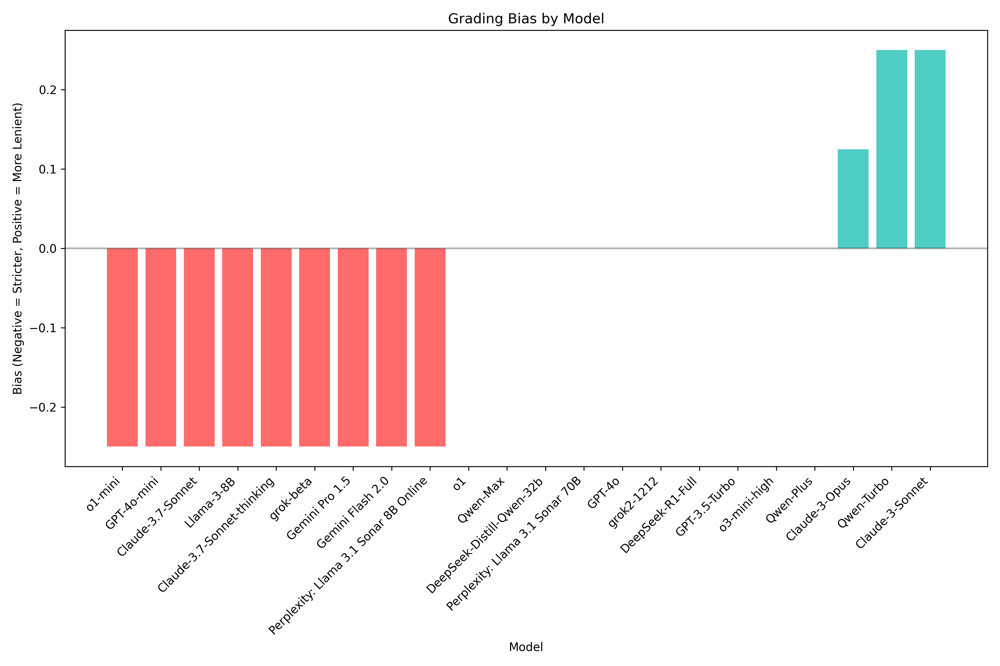

# Boswell Test Results: Political Science Evaluation (March 5, 2025)

This directory contains the results of a Boswell evaluation for political science models conducted on March 5, 2025. The evaluation compares various AI models on their ability to produce and grade political science essays.

## Table of Contents

- [Files and Assets](#files-and-assets)
- [Charts](#charts)
  - [Grade Distribution](#grade-distribution)
  - [Boswell Quotient](#boswell-quotient)
  - [Boswell Quotient Components](#boswell-quotient-components)
  - [Grading Bias](#grading-bias)
  - [Cost Analysis](#cost-analysis)
  - [Time Performance](#time-performance)

## Files and Assets

| File/Directory | Description |
|----------------|-------------|
| `boswell_quotient.md` | Summary of the Boswell Quotient scores for each model |
| `boswell_report.md` | Detailed Boswell performance report |
| `charts/` | Directory containing all visualization charts |
| `cost_report.md` | Analysis of API costs for each model |
| `essays/` | Directory containing all model-generated essays |
| `full_results.json` | Complete test results in JSON format |
| `grades.json` | All grading data in JSON format |
| `grades_table.csv` | Model grades in CSV format |
| `grades_table.md` | Model grades in Markdown format |
| `grades_table.txt` | Model grades in text format |
| `grading_bias.md` | Analysis of grading bias between models |
| `timing_report.md` | Performance timing analysis |

## Charts

### Grade Distribution

### Boswell Quotient

### Boswell Quotient Components

### Grading Bias

### Cost Analysis

### Time Performance

